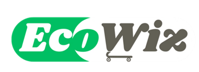

<h1 align ="center">
   
   
   
  <strong>
  🛒 ECO-FRIENDLY POS SYSTEM
  </strong>
   
</h1>

  
  
  
  

<h2 align = "center">
        
</h2>

> **Note:**
> Please click this <a href="https://example.com"><strong>link</strong></a> to watch the demonstration video.
___
## I. PROJECT OVERVIEW&nbsp;🚀
&nbsp;&nbsp;&nbsp;&nbsp;&nbsp;&nbsp;&nbsp;&nbsp;&nbsp;&nbsp;&nbsp;&nbsp;This Java-based console system was designed to support the United Nations' 12th Sustainable Development Goal (SDG) – Responsible Consumption and Production. The system simulates a point-of-sale (POS) transaction platform focused on promoting eco-friendly products. It calculates environmental impact scores and offers incentives for sustainable purchases. Developed using Java and backed by MySQL for database management, the system ensures efficient storage and retrieval of product data, transaction details, and user information.

Discover more: [Features](#features) • [Goal](#goal) • [Limitation](#limitation)

###  &nbsp;&nbsp;🔑&nbsp;&nbsp;**FEATURES**
- **Eco-Friendly Product Focus**: The system promotes sustainable products, contributing to responsible consumption and production.
- **Incentive and Reward System**: Users earn points for purchasing eco-friendly products, which can be redeemed for discounts, encouraging further sustainable purchasing behavio
- **Database Integration**: MySQL is used to store product details, user profiles, transaction history, and user activity.
- **User Interface**: The console-based interface allows users to browse products, make purchases, check environmental impact scores, and track reward points.

###   &nbsp;&nbsp;🥅&nbsp;&nbsp;**GOAL**
&nbsp;&nbsp;&nbsp;&nbsp;&nbsp;&nbsp;&nbsp;&nbsp;&nbsp;&nbsp;&nbsp;&nbsp;This project aims to promote eco-friendly products in our supermarket by assigning eco points (1-10) based on environmental impact scores. It offers consumers discounts based on the eco points they have earned. The core focus is on incentivizing sustainable consumer behavior and responsible consumption within the retail environment.

###   &nbsp;&nbsp;🚧&nbsp;&nbsp;**LIMITATION**
&nbsp;&nbsp;&nbsp;&nbsp;&nbsp;&nbsp;&nbsp;&nbsp;&nbsp;&nbsp;&nbsp;&nbsp;This project does not cover administrative features such as checking product availability, updating product prices, or managing product quantities. Although these features would add value to the system, they were excluded due to time constraints and the creators' involvement in other ongoing projects. Despite these exclusions, the project successfully meets the rubric requirements and adheres to Object-Oriented Programming (OOP) principles.

## II. Object-oriented Programming Principles

## III. SDG Integration

## IV. How to run the Program?

